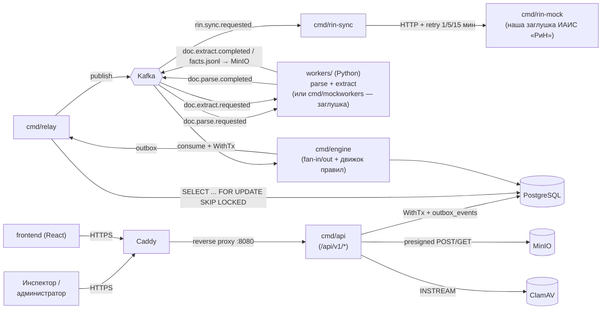

# Архитектура

Этот документ описывает, как устроен backend «Инспектор ИИ»: из чего он состоит, какими принципами и
паттернами связаны части, и почему приняты ключевые технические решения. Модель данных, контракты
событий и полный список требований ТЗ — в [backend-plan.md](backend-plan.md); здесь — только то, что
нужно, чтобы ориентироваться в коде и не наступать на грабли, которые уже были учтены при проектировании.

## Обзор



Ключевая идея: **всё тяжёлое — асинхронно** (ТЗ 11, p95 API ≤ 200 мс). `cmd/api` только принимает
запросы, читает/пишет Postgres и отдаёт быстрый ответ; разбор документов, сравнение параметров и
доставка во внешние системы происходят в фоновых сервисах, связанных через Kafka.

**Воркеры** — Python-пакет [`workers/`](../workers/README.md): `parse` (PDF/DOCX/XML → layout с bbox) и
`extract` (layout → факты по Матрице: regex-шаблоны + опциональный LLM). Общаются с оркестратором
только через Kafka и MinIO по контракту `contracts/events/*.schema.json` + `contracts/facts.schema.json`;
писать в Kafka напрямую они не могут — как и Go-сервисы, публикуют через `outbox_events` (transactional
outbox) и дедуплицируют через `consumed_events`. `cmd/mockworkers` — прежняя Go-заглушка тех же
воркеров, оставлена для тестов и запуска без Python (**запускать одно из двух, не оба**: оба слушают
одни топики). `cmd/rin-mock` — заглушка ИАИС «РиН» (внешняя система, её у нас нет).

## Компоненты (`backend/cmd/*`)

Один Docker-образ, один бинарь на команду `cmd/`; конкретный сервис в docker-compose/kubernetes
выбирается командой запуска (`/app/bin/api`, `/app/bin/engine`, ...) — см. [backend/Dockerfile](../backend/Dockerfile).

| Бинарь | Роль | Статус |
|---|---|---|
| `cmd/api` | HTTP API: auth, объекты, документы, процессы, findings, протокол, `/healthz` `/readyz` `/metrics` | реализовано (до границы M1+M2+M3(частично)+M4(частично), см. ниже) |
| `cmd/relay` | Единственный писатель в Kafka: забирает `outbox_events` и публикует | реализовано |
| `cmd/engine` | Consumer результатов воркеров: fan-in/fan-out `parse_jobs`→`extract_jobs`, валидация фактов, движок правил (8 типов, 71 правило из 132 параметров), READY + протокол | реализовано |
| `workers/` (Python) | parse- и extract-воркеры, см. [workers/README.md](../workers/README.md) | реализовано |
| `cmd/mockworkers` | Go-заглушка тех же воркеров — для тестов и запуска без Python | реализовано, вспомогательное |
| `cmd/rin-sync` | Отправка финализированных протоколов в ИАИС «РиН» с ретраями (1/5/15 мин, конфигурируемо) | реализовано |
| `cmd/rin-mock` | Заглушка ИАИС «РиН» для демо и тестов ретраев (`--fail-every=N`) | реализовано |
| `cmd/tools/seed-users` | Тестовые пользователи (по одному на роль) | реализовано |
| `cmd/tools/import-matrix` | Матрица параметров (132 строки) из `docs/source/*.xlsx` → таблица `params` + экспорт `contracts/matrix.json` для воркеров | реализовано (`make seed`) |
| `cmd/tools/export-dataset` | Экспорт GOLD-датасета для дообучения модели | **не реализовано** (M5) |

## `internal/platform` — общая инфраструктура

Пакеты, от которых зависят все `cmd/*`, но которые ничего не знают о домене (объекты, процессы,
findings). Домен в `internal/<domain>/` появляется начиная с M1 и строится поверх этого слоя.

| Пакет | Отвечает за |
|---|---|
| `internal/config` | Загрузка конфигурации: `config.yaml` + переопределение из ENV (`cleanenv`); без файла — только ENV |
| `internal/platform/db` | Пул `pgx/v5`, health-check, `WithTx` — unit-of-work для транзакций |
| `internal/platform/kafka` | `Producer`/`Consumer` поверх `confluent-kafka-go/v2`: delivery reports, ручной commit offset |
| `internal/platform/minio` | Клиент MinIO, обеспечение бакета |
| `internal/platform/httpx` | Обёртка gin-сервера (graceful shutdown) + `AppError`/`ErrorResponse` (единый формат ошибок) |
| `internal/platform/httpx/middleware` | `RequestID`, `Recovery`, `Logger` |
| `internal/platform/logging` | `slog.Logger`, JSON в stdout, поля `timestamp/level/service/message/...` |
| `internal/platform/metrics` | `prometheus/client_golang`, namespace `inspector_`, middleware для HTTP-метрик |
| `internal/platform/health` | `/healthz` (liveness) и `/readyz` (readiness, гоняет `Checker`-и по зависимостям) |
| `internal/platform/clamav` | Свой TCP-клиент протокола INSTREAM (без внешней зависимости) — антивирусная проверка при confirm |
| `internal/platform/outbox` | `Insert` (запись события в транзакции) + `Relay` (claim/publish/backoff, см. паттерн ниже) |
| `internal/platform/idempotency` | `Once(...)` — идемпотентная обработка одного Kafka-сообщения через `consumed_events` |
| `internal/platform/events` | Consumer-сторона конверта события (`Envelope` + `DecodeData`) — зеркало `outbox.Envelope` |
| `internal/platform/dbtest` | Тестовый хелпер: testcontainers Postgres/MinIO + применение миграций, используется во всех интеграционных тестах |

## Доменные пакеты (`internal/<domain>`)

Каждый домен — это `model.go` (типы и enum-константы), `repository.go` (SQL через `db.Querier` —
единый интерфейс, которому удовлетворяют и `*pgxpool.Pool`, и `pgx.Tx`, поэтому один и тот же
репозиторий работает что вне транзакции, что внутри `WithTx`), `service.go` (бизнес-логика) и,
если у домена есть HTTP-эндпоинты — `http.go` (реализация части `gen.ServerInterface`).

| Пакет | Отвечает за |
|---|---|
| `internal/auth` | bcrypt, JWT (HS256, 12ч), `AttachClaims`/`Require`/`RequireRole` — middleware и контекстные хелперы |
| `internal/audit` | `Log(ctx, tx, Entry)` — запись в `audit_log` внутри той же транзакции, что бизнес-изменение |
| `internal/objects` | CRUD объектов строительства |
| `internal/files` | Upload (presigned POST), Confirm (sha256+ClamAV+magic bytes+pdfcpu), реестр (CSV/JSON/XLSX), выбор актуальной редакции (`SelectCurrent`, чистая функция) |
| `internal/process` | Машина состояний процесса, сценарий (`ComputeScenario`), запуск (нарезка `parse_jobs`), finalize/unfinalize |
| `internal/engine` | Fan-in/fan-out `parse_jobs`→`extract_jobs`→READY, приём фактов (`ProcessFacts`), сборка `evidence_groups`/`checks`/`findings` |
| `internal/engine/rules` | Механизм правил (`numeric_equal`, `threshold_min`, `threshold_max` + fallback `NOT_COMPARABLE`), загрузка `rules/*.yaml` |
| `internal/mockworkers` | Go-заглушка воркеров — синтетические факты по реальным кодам Матрицы (M-001, M-041) |
| `internal/matrix` | Чтение Матрицы из xlsx, загрузка в `params`, каталог для `GET /params` |
| `internal/findings` | Верификация: `Decide` (атомарно finding + audit + переход READY→VERIFYING→COMPLETED) |
| `internal/protocol` | Сборка протокола (JSON) из findings + метаданных версии |
| `internal/rin` | Payload для ИАИС «РиН», HTTP-клиент с ретраями, `Signer` (заглушка УКЭП) |
| `internal/transport/http/api` | **Композиционный корень**: единственное место, которому разрешено импортировать все домены сразу и реализовывать `gen.ServerInterface` целиком |

### Инверсия зависимостей между доменами

Домены не импортируют друг друга напрямую, если это создало бы цикл. Вместо этого домен объявляет
узкий интерфейс с тем, что ему нужно от соседа, а конкретная реализация подставляется при сборке
графа зависимостей в `cmd/api/main.go` (`wireServer`). Примеры:

- `process` не импортирует `files`, но объявляет `FileLister` (`ListCurrentAccepted`) — при сборке
  подставляется адаптер `api.NewFileLister(filesRepo)` (см. `internal/transport/http/api/adapter.go`),
  конвертирующий `files.File` → `process.CurrentFile`.
- `process` объявляет `FindingsGate` (`HasPendingCandidates`) — `findings.Service` удовлетворяет ему
  структурно, без импорта.
- `files` объявляет `ProcessGate` (`EnsureUploadable`, `UpdateScenario`) — `process.Service` уже имеет
  методы с точно такой сигнатурой, подставляется напрямую.

`internal/transport/http/api` — единственный пакет, которому позволено знать про все домены сразу
(он и делает `ListProcessFiles`/`GetProcess`/... — ответы, которые физически требуют данных больше
чем из одного домена). Если появится циклическая зависимость между двумя доменными пакетами — это
всегда решается новым узким интерфейсом на стороне потребителя, а не общим импортом.

## Паттерны

### Spec-first контракт (правило работы №1, `backend/CLAUDE.md`)

`contracts/openapi.yaml` — источник истины для HTTP API. Любое изменение API: сначала правки в
`openapi.yaml`, затем `make gen` (генерирует `internal/transport/http/gen` через `oapi-codegen`,
профиль `gin-server` + `types`), затем реализация хендлера. Свой Swagger UI сервис отдаёт статикой
по `/swagger` (см. `registerSwagger` в [cmd/api/main.go](../backend/cmd/api/main.go)) — без swaggo/swag
(генерирует устаревший Swagger 2.0, был в исходном каркасе, убран при переносе).

То же правило для событий Kafka: сначала JSON Schema в `contracts/events/`, `contracts/facts.schema.json`,
`contracts/layout.schema.json` — они общий контракт с Python-воркерами, менять без предупреждения нельзя.

### Unit of work (`db.WithTx`)

```go
err := database.WithTx(ctx, func(tx pgx.Tx) error {
    // бизнес-изменение и outbox-запись — одна транзакция
    if err := saveDomainChange(ctx, tx, ...); err != nil {
        return err
    }
    return insertOutboxEvent(ctx, tx, ...)
})
```

`WithTx` в [internal/platform/db/db.go](../backend/internal/platform/db/db.go) коммитит при успехе,
откатывает при ошибке или панике. Это основа паттерна Transactional Outbox ниже — без единой транзакции
на бизнес-изменение и запись в outbox между Postgres и Kafka возможна рассинхронизация (записали в БД,
не отправили событие, или наоборот).

### Transactional Outbox + Relay

Бизнес-код **никогда не пишет в Kafka напрямую** — только `cmd/relay` (правило работы №5). Вместо этого
в той же транзакции, что бизнес-изменение, делается `INSERT INTO outbox_events`. `cmd/relay`:

1. Забирает пачку `SELECT ... FOR UPDATE SKIP LOCKED LIMIT 100`, ставит `status='publishing'`.
2. Публикует в Kafka, дожидается delivery report → `status='published'`.
3. Ошибка → `status='failed'`, `available_at` с экспоненциальным backoff (до 60 с). Несколько реплик
   relay безопасны за счёт `SKIP LOCKED`; зависшие `publishing` дольше 2 минут переподхватываются.

Гарантия: если бизнес-транзакция закоммитилась — событие рано или поздно будет опубликовано (at-least-once).
Consumers поэтому обязаны быть идемпотентными (см. ниже).

### Идемпотентный consumer

`enable.auto.commit=false` жёстко зашито в `internal/platform/kafka` (не настраивается конфигом —
это была одна из обязательных правок при переносе старого каркаса, см. backend-plan.md §2). Цикл
обработки:

```
BEGIN
  INSERT INTO consumed_events (consumer_name, event_id) ON CONFLICT DO NOTHING
  -- 0 строк вставлено → уже обработано, просто commit offset
  бизнес-логика
  INSERT INTO outbox_events (...)  -- если нужно
COMMIT
commit Kafka offset
```

Offset коммитится только после успешного коммита транзакции Postgres — иначе при падении между
`COMMIT` и коммитом offset сообщение переобработается, но `consumed_events` не даст применить его дважды.
После 3 неудачных попыток с backoff — публикация в `<topic>.dlq` и commit offset (не блокировать партицию).

### Единый формат ошибок API

`internal/platform/httpx/errors.go`: `AppError{Code, Message, HTTPStatus, Details}` →
`ErrorResponse(err, requestID)` сериализует в `{"error": {"code","message","details"}, "request_id"}`
(backend-plan.md §7). `RequestID` прокидывается через `middleware.RequestID()` в заголовок ответа и в
логи каждого запроса — по нему можно сопоставить лог, ответ клиенту и запись в `audit_log`.

### Один образ — несколько бинарей

`backend/Dockerfile` собирает `api/relay/engine/rin-sync/rin-mock` в один слой `/app/bin/`; какой
бинарь запускать, решает `command:` в docker-compose/манифесте. Это упрощает сборку и версионирование
(один тег образа = одна версия всех сервисов), а не про экономию места.

### Graceful shutdown

`cmd/api/main.go`: `signal.NotifyContext(SIGINT, SIGTERM)` → `select` между сигналом и ошибкой сервера →
`server.Shutdown()` с таймаутом (`ShutdownTimeout`, по умолчанию 5с) → закрытие пула БД. Тот же принцип
для будущих `relay`/`engine`: `consumer.Close()` и `producer.Flush()` перед выходом (проверено в
исходном каркасе при переносе, см. backend-plan.md §2 «Проверить в перенесённом коде»).

## `tools/`-модуль и почему он отдельный

`backend/go.mod` жёстко пин Go 1.24 (`backend/CLAUDE.md`: «не менять без согласования с человеком»).
Но `golangci-lint/v2` по своей политике всегда требует «последнюю версию Go минус одна» — т.е. любая
версия v2.x как прямая зависимость `backend/go.mod` рано или поздно заставит `go mod tidy` поднять
`go`-директиву. Такая же проблема была с `embedded-spec: true` в `oapi-codegen.yaml`: генератор тянет
`kin-openapi`, чьи транзитивные зависимости тоже требуют более новый Go (сейчас `embedded-spec`
отключён — Swagger UI и так читает `contracts/openapi.yaml` напрямую, эмбеддить спеку в бинарь незачем).

Решение: `tools/` — независимый Go-модуль (свой `go.mod`, версия Go не связана с `backend/`), в котором
живут `tool`-директивы на `golangci-lint/v2` и `oapi-codegen/v2`. `backend/Makefile` собирает из него
обычные бинари в `backend/bin/` (`go build -C ../tools -o ...`, см. цели `gen`/`lint`/`tools`) и
дальше вызывает их как любой внешний CLI. Это полностью развязывает версию Go в `backend/go.mod` от
требований dev-инструментов. `GOTOOLCHAIN=auto` (по умолчанию) сам скачивает нужный toolchain при сборке
`tools/`, вручную ничего ставить не нужно.

Если добавляете новый dev-инструмент через `go get -tool` — делайте это в `tools/go.mod`, не в
`backend/go.mod`.

## Данные

Полная схема миграций — [backend-plan.md §5](backend-plan.md#5-схема-бд-миграции). Коротко, по
слоям (каждый — отдельная миграция, миграции только добавляются, не редактируются — правило №2):

- `0001_platform` — `users`, `outbox_events`, `consumed_events`, `idempotency_keys`, `audit_log`.
- `0002_objects_files` — `objects`, `processes`, `files`, `registry_entries`, `upload_status`.
- `0003_parsing` — `parse_jobs`, `extract_jobs`.
- `0004_matrix` — `params` (132 параметра), `normative_base`, `logical_rules`.
- `0005_checks` — `facts`, `evidence_groups`, `checks`, `evidence_fragments`, `findings`, `suspicions`.
- `0006_protocol` — `protocols`, `rejection_log`, `dispute_log`.
- `0007_ml` — `dataset_items`, `model_versions`, `ml_retraining_log`.
- `0008_files_sha256_nullable`, `0009_facts_sha256_nullable` — точечные правки черновика 0002/0005:
  `sha256` файла известен только после `confirm`, а запись создаётся раньше (на `upload`) — `NOT NULL`
  в черновике был багом. Правило №2 (`backend/CLAUDE.md`) соблюдено: не редактируем 0002/0005
  напрямую, добавляем новую миграцию.

## Событийная архитектура

Конверт события (все топики):

```json
{
  "event_id": "uuid",
  "event_type": "doc.parse.requested",
  "schema_version": 1,
  "occurred_at": "RFC3339",
  "correlation_id": "process_id",
  "object_id": "uuid",
  "process_id": "uuid",
  "data": { "...": "только ссылки на MinIO, не содержимое — лимит сообщения ~1 МБ" }
}
```

Ключ сообщения — `object_id` (события одного объекта попадают в одну партицию — порядок сохраняется
внутри объекта). Топики (3 партиции / 7 дней для рабочих, 1 партиция / 30 дней для `*.dlq`):

| Топик | Producer | Consumer |
|---|---|---|
| `doc.parse.requested` | relay (из api) | parse-воркер |
| `doc.parse.completed` | parse-воркер | engine |
| `doc.extract.requested` | relay (из engine) | LLM-воркер |
| `doc.extract.completed` | LLM-воркер | engine |
| `protocol.ready` | relay (из engine) | уведомления (опционально) |
| `rin.sync.requested` | relay (из api, при финализации) | rin-sync |
| `*.dlq` | любой consumer после исчерпания попыток | алерт, ручной replay |

## Архитектурные решения

Осознанные отступления от ТЗ (ТЗ по умолчанию предполагал Node.js/RabbitMQ):

- **Go вместо Node.js.** Компилируемый бинарь без рантайма, сильная типизация для доменной модели
  со строгими enum'ами (раздел 4.1 ТЗ), зрелые библиотеки для pgx/Kafka/MinIO, конкурентность
  (`goroutine`) естественно ложится на fan-out/fan-in заданий парсинга (`parse_jobs`/`extract_jobs`).
- **Kafka вместо RabbitMQ.** Нужен durable event log с воспроизводимостью (переиграть `doc.extract.completed`
  при обновлении правил без повторного парсинга), партиционирование по `object_id` для упорядоченности,
  и консьюмер-группы для нескольких инстансов `cmd/engine`. У RabbitMQ это сложнее и менее естественно.
- **Kafka в режиме KRaft** (`apache/kafka`, без ZooKeeper) — меньше движущихся частей на демо-стенде,
  ZooKeeper для одного брокера не даёт выгоды.
- **Отдельный `tools/`-модуль** — см. раздел выше.
- **Single-node Kafka требует `OFFSETS_TOPIC_REPLICATION_FACTOR=1`/`TRANSACTION_STATE_LOG_REPLICATION_FACTOR=1`.**
  Обнаружено при первом реальном сквозном прогоне: дефолтный replication factor внутренних топиков —
  3, но брокер один, поэтому `__consumer_offsets`/`__transaction_state` вообще не создавались и ни
  один consumer group не мог закоммитить offset (до этого стенд проверялся только по списку топиков
  в kafka-ui на M0, ни разу не гонялся настоящий consumer — см. `infra/docker-compose.yml`).

Обе замены осознанные и зафиксированы здесь по требованию ТЗ (задокументировать отступления).

## Границы текущей реализации

Явно не сделано (см. `docs/backend-plan.md §12` и историю вех), чтобы не путать с недоработками:

- **Каталог правил Матрицы — 71 из 132 параметров.** `backend/rules/M-XXX.yaml` выведены из колонки
  «Логика ИИ-связи» и помечены как черновик для подтверждения экспертом (`TODO(TZ)`). Остальные 61
  параметра (качественные: «наличие», «состав», «технология», статусы ОСИГ/ГЛОНАСС и т.п.) получают
  `NOT_COMPARABLE / RULE_NOT_IMPLEMENTED` — прямой fallback из §8.5 п.1, не ошибка. Не реализованы типы
  правил `set_difference`, `presence`, `tolerance` (нужны элементы и допуски).
- **Извлечение**: regex-шаблоны покрывают 44 параметра в «явных» формулировках; всё остальное — только
  через LLM (`LLM_BASE_URL`/`LLM_MODEL`, не проверялся на реальной модели в этой среде — только на
  тестовом HTTP-сервере) либо остаётся без факта. OCR для сканов подключён, но не проверен на настоящем
  tesseract (его нет в среде разработки).
- **Единицы и мета-данные**: факт сравнивается в единицах Матрицы (`params.unit`); конверсия реализована
  только для длин (мм/см/м). Строки/таблицы с несколькими объектами (`element_key`: помещения, квартиры)
  воркеры пока не различают — один факт на параметр и стадию.
- **`quality=LOW_QUALITY` у фактов** движком пока не учитывается (§8.5 п.4 — `NOT_COMPARABLE` при
  одних только низкокачественных фактах).
- **`POST /findings/{id}/split`**, suspicions API, админ-эндпоинты Матрицы/нормативов/пользователей,
  ML dataset export — не в контракте.
- **Экспорт протокола** — только JSON (`GET /processes/{id}/protocol`); PDF/XML/DOCX через gotenberg — нет.
- **Инкрементальный пересчёт** (`input_hash`, дозагрузка после READY без полного пересчёта) — не
  реализован; `input_hash` в `evidence_groups` считается, но не переиспользуется.
- **УКЭП-подпись** в `cmd/rin-sync` — `rin.Signer` с no-op реализацией, как и предписано §8.9.
- **Таймауты заданий** (§8.3: тикер раз в 30 с, повтор до 2 раз) — не реализованы: если воркер вообще не
  ответил (упал, не запущен), процесс остаётся в `PARSING`. Воркеры, которые ответили `FAILED`/`error`,
  обрабатываются штатно (job → FAILED, процесс идёт дальше).

## Надёжность доставки (Kafka)

- **Go-consumer'ы** (`engine`, `rin-sync`, `mockworkers`): до 3 попыток с линейным backoff, затем
  сообщение уходит в `<topic>.dlq` (тело как есть + причина/источник в заголовках `dlq_*`), offset
  коммитится. Если положить в DLQ не удалось — коммита нет и отправка повторяется, а не теряется.
  До этого ошибка обработчика молча пропускала сообщение (следующий commit «перепрыгивал» его) —
  найдено живым прогоном, когда устаревшие сообщения в Kafka вызвали ошибки в engine.
- **Python-воркеры**: та же схема (`WORKER_MAX_ATTEMPTS`), плюс воркер сам публикует «сбойный» результат
  (`quality=FAILED` / `error`), чтобы процесс не завис. Сообщения, нарушающие контракт, уходят в DLQ
  сразу, без повторов.
- **Replay из DLQ** — вручную (`kafka-console-consumer` → повторная публикация); CLI/эндпоинт не сделаны.

## Хранилище файлов: MinIO

`minio/minio` и `minio/mc` **удалены с Docker Hub** (MinIO перестал публиковать готовые образы), а
`quay.io/minio` требует авторизации. Стенд и тесты используют `cgr.dev/chainguard/minio` — тот же MinIO,
собранный из исходников Chainguard (анонимный pull). Образ distroless: нет shell и `mc`, поэтому нет
healthcheck через `mc ready` и контейнера-создателя бакетов — бакет создают сам backend и воркеры при
старте. Имя образа в двух местах: `infra/docker-compose.yml` и `backend/internal/platform/dbtest/minio.go`.
