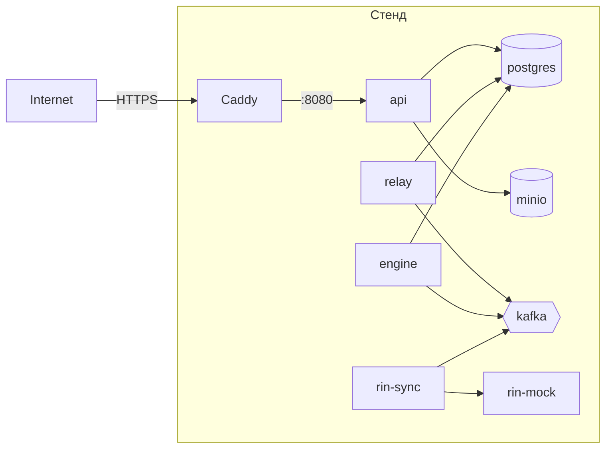

# Сборка и развёртывание на стенде

Локальный запуск для разработки описан в [development.md](development.md) — там API работает на хосте
через `go run`, а Docker-контейнер API не используется. Этот документ — про общий (демо-)стенд, где
`api`/`relay`/`engine`/`rin-sync`/`rin-mock` работают как контейнеры из собранного образа, а не `go run`.

## Модель развёртывания

Один Docker-образ (`backend/Dockerfile`) содержит все бинари `cmd/*`; конкретный сервис на стенде —
это тот же образ, запущенный с разной командой. Инфраструктура (Postgres, Kafka, MinIO, Prometheus,
...) — та же `infra/docker-compose.yml`, что и локально; отличие стенда — backend-сервисы тоже
поднимаются в compose (а не на хосте), и конфигурация идёт через ENV, а не `config.yaml`.



## 1. Сборка образа

```bash
cd backend
docker build -t ghcr.io/tanoklllmonbku/hakaton-ldt-backend:<tag> .
```

`<tag>` — короткий git SHA или версия релиза (например `git rev-parse --short HEAD`). Не используйте
`latest` на стенде — при обновлении невозможно будет откатиться на конкретную версию.

CI ([.github/workflows/ci.yml](../.github/workflows/ci.yml)) на текущем этапе проверяет `build/vet/lint/test`,
но не пушит образ — публикация в registry подключается отдельным job'ом, когда появится реальный стенд
(добавить `docker/build-push-action` + `docker/login-action` с логином в GHCR по `GITHUB_TOKEN`).

Локально проверить, что собранный образ рабочий, можно без полного стенда:

```bash
docker run --rm ghcr.io/tanoklllmonbku/hakaton-ldt-backend:<tag> /app/bin/api --help 2>&1 | head
```

## 2. Инфраструктура

На выделенной машине (или VM):

```bash
git clone <repo> && cd Hakaton-LDT/infra
docker compose up -d postgres minio minio-createbuckets kafka kafka-init kafka-ui redis clamav gotenberg \
    prometheus grafana alertmanager
```

Дождаться `docker compose ps` — все нужные сервисы `healthy`/`Up`. ClamAV поднимается дольше остальных
(качает базы сигнатур, `start_period: 120s`).

## 3. Backend-сервисы

На стенде backend-сервисы **не** используют `config.yaml` — только ENV (см. `.env.example` в
`backend/`, правило №10 `backend/CLAUDE.md`: секреты только через ENV, `config.yaml` в образ не
попадает — `Dockerfile` кладёт только `config.example.yaml`, которого достаточно для дефолтов, всё
чувствительное переопределяется ENV).

Добавьте в `infra/docker-compose.yml` (или в отдельный `infra/docker-compose.stand.yml`, накатываемый
поверх через `-f`) сервисы backend, например:

```yaml
services:
  api:
    image: ghcr.io/tanoklllmonbku/hakaton-ldt-backend:<tag>
    command: ["/app/bin/api"]
    env_file: [.env]
    environment:
      DATABASE_HOST: postgres
      BROKER_BOOTSTRAP_SERVERS: kafka:9092
      MINIO_ENDPOINT: minio:9000
    ports: ["8080:8080", "9091:9091"]
    depends_on:
      postgres: { condition: service_healthy }
      kafka: { condition: service_healthy }
    networks: [inspector-net]

  relay:
    image: ghcr.io/tanoklllmonbku/hakaton-ldt-backend:<tag>
    command: ["/app/bin/relay"]
    env_file: [.env]
    networks: [inspector-net]

  # engine, rin-sync, rin-mock — аналогично, появятся начиная с M2–M4
```

`.env` на стенде — реальный файл с секретами (пароли БД, ключи MinIO), **не коммитится**, живёт только
на машине стенда (или в секрет-хранилище CI/CD, если развёртывание автоматизировано). Начните с
[backend/.env.example](../backend/.env.example) как шаблона состава переменных.

## 4. Миграции

Миграции применяются отдельным шагом при выкладке, не автоматически при старте `api` (осознанно — чтобы
накат схемы был контролируемым и виден в логах деплоя отдельно от рестарта сервиса):

```bash
cd backend
DATABASE_USER=... DATABASE_PASSWORD=... DATABASE_DATABASE=inspector make migrate
```

`make migrate` разворачивает `golang-migrate` в Docker-контейнере на сети `inspector-net` — на стенде
это можно гонять как отдельный шаг CD-пайплайна перед перезапуском `api`.

## 5. TLS / реверс-прокси

`infra/caddy/Caddyfile` в текущем виде рассчитан на локальный само-подписанный сертификат
(`tls internal`) и проксирует на `host.docker.internal:8080` (локальный `go run`). На стенде, где `api`
работает в том же compose, поменяйте:

- `reverse_proxy host.docker.internal:8080` → `reverse_proxy api:8080` (имя сервиса в сети `inspector-net`);
- `tls internal` → реальный домен и `tls {email}` (Caddy сам получит сертификат Let's Encrypt), если у
  стенда есть публичный DNS-домен; иначе оставьте `tls internal` и добавьте корневой сертификат клиентам.

## 6. Проверка после выкладки

```bash
curl -sf https://<стенд>/healthz
curl -sf https://<стенд>/readyz
curl -s https://<стенд>/metrics | grep inspector_ | head
```

Плюс проверки из [operations.md#health-checks](operations.md#health-checks) — Grafana дашборд, kafka-ui
на предмет накопления в топиках (значит consumer не тянет), Alertmanager без активных алертов.

## 7. Откат

Так как образы тегируются по git SHA, откат — смена тега в compose/манифесте на предыдущий и
`docker compose up -d <service>` (пересоздаёт только изменившиеся контейнеры). Миграции **не
редактируются задним числом** (правило №2) — откат схемы БД делается новой миграцией, откат кода один
не откатывает БД сам по себе; проверяйте совместимость новой миграции со старым кодом при планировании
отката.

## Дальнейшие шаги (не сделано, по мере вех)

- Автоматизация: job в `.github/workflows/` на сборку + пуш образа в GHCR и (опционально) деплой по SSH
  или через registry webhook — сейчас CI только `build/vet/lint/test`.
- Секреты на стенде — сейчас `.env`-файл руками; для продакшен-уровня стоит вынести в секрет-менеджер
  (например, GitHub Actions secrets + `docker compose --env-file` при деплое, или Vault).
- Бэкапы и восстановление Postgres на стенде — см. [operations.md#бэкапы](operations.md#бэкапы).
