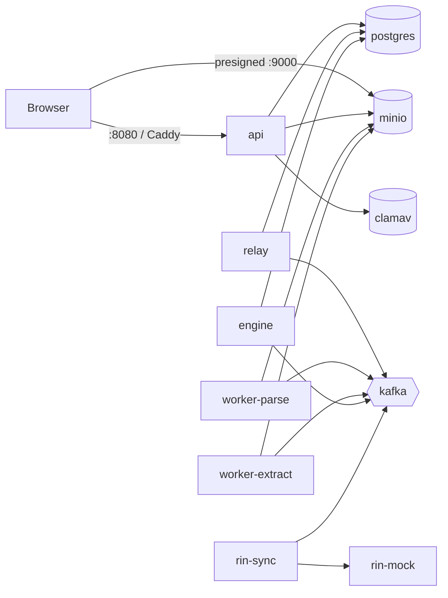

# Сборка и развёртывание на стенде

Локальный запуск для разработки описан в [development.md](development.md) — там сервисы работают на хосте
через `go run`. Этот документ — про **тестовый стенд**, где всё (backend и Python-воркеры) запускается
контейнерами из собранных образов.

## Модель развёртывания

Два образа:

| Образ | Dockerfile | Содержит |
|---|---|---|
| `inspector-backend` | `backend/Dockerfile` | все бинари Go: `api`, `relay`, `engine`, `rin-sync`, `rin-mock`, `mockworkers`, `import-matrix`, `seed-users`; `rules/`, `contracts/`, xlsx Матрицы |
| `inspector-workers` | `workers/Dockerfile` | Python-воркеры `parse` и `extract` (+ tesseract для OCR), `contracts/` |

Конкретный сервис — тот же образ с другой командой. Инфраструктура (Postgres, Kafka, MinIO, ClamAV, ...) —
`infra/docker-compose.yml`; сервисы приложения — оверлей `infra/docker-compose.stand.yml`.



## Быстрый старт (тестовый стенд одной командой)

```bash
cd infra
cp .env.stand.example .env
#   AUTH_JWT_SECRET — обязательно (openssl rand -hex 32); STAND_HOST — адрес машины, как его видит браузер
docker compose -f docker-compose.yml -f docker-compose.stand.yml up -d --build
```

Порядок старта compose выстраивает сам: `postgres → migrate → seed → engine/api/relay/воркеры`.
`migrate` накатывает миграции, `seed` загружает 132 параметра Матрицы и **демо-пользователей** (пароль
`demo-password-123` — только для тестового стенда, на боевом не запускать `seed-users`).

Что публикуется наружу: **API — :8080**, Swagger — `:8080/swagger`, **MinIO — :9000** (браузер грузит и
скачивает файлы напрямую по presigned-ссылкам), kafka-ui — :8090, Grafana — :3001.

### Два адреса MinIO — почему это важно

Backend ходит в MinIO по внутреннему адресу (`minio:9000`), а presigned-ссылки отдаются браузеру и должны
быть подписаны под адрес, **который браузер видит**: подпись включает Host, подменить его нельзя. Поэтому у
`api` два параметра: `MINIO_ENDPOINT` (внутренний) и `MINIO_PUBLIC_ENDPOINT` (в оверлее это
`${STAND_HOST}:9000`). Если `STAND_HOST` не тот, загрузка файлов из браузера не заработает, хотя API отвечает.
Для HTTPS-домена добавьте `MINIO_PUBLIC_USE_SSL=true`.

### Проверка после выкладки

```bash
curl -sf http://<стенд>:8080/healthz && curl -sf http://<стенд>:8080/readyz
docker compose -f docker-compose.yml -f docker-compose.stand.yml ps      # seed/migrate — Exited (0), остальные Up
python3 scripts/e2e.py --api http://<стенд>:8080/api/v1                   # сквозной сценарий: должен закончиться «ИТОГ: OK»
```

Плюс [operations.md#health-checks](operations.md#health-checks): Grafana, kafka-ui (накопление в топиках =
consumer не тянет), сообщения в `*.dlq`.

## Сборка образов отдельно

Контекст сборки — **корень репозитория** (нужны `contracts/` и `docs/source/*.xlsx`):

```bash
docker build -f backend/Dockerfile -t inspector-backend:$(git rev-parse --short HEAD) .
docker build -f workers/Dockerfile -t inspector-workers:$(git rev-parse --short HEAD) .
```

Тег — короткий git SHA или версия релиза; не используйте `latest` на стенде — откатиться будет некуда.
`TAG` в `infra/.env` подставляется в оверлей. CI сейчас проверяет `build/vet/lint/test` (Go) и `pytest`
(воркеры), но образы не пушит — публикация в registry подключается отдельным job'ом, когда появится
реальный стенд.

## Конфигурация и секреты

Сервисы читают `config.yaml` из образа (это `config.example.yaml` — безопасные дефолты) и переопределяют
ENV-переменными; секреты — только ENV (правило №10 `backend/CLAUDE.md`). Состав переменных —
`backend/.env.example`. На стенде секреты живут в `infra/.env` (в `.gitignore`), не в репозитории.

Заданные в оверлее по умолчанию учётные данные Postgres (`postgres/postgres`) и MinIO (`minioadmin`) — для
тестового стенда в закрытой сети; для всего, что видно снаружи, задайте `DATABASE_PASSWORD`,
`MINIO_ACCESS_KEY`, `MINIO_SECRET_KEY` в `infra/.env` (и те же значения для контейнеров `postgres`/`minio` в
`docker-compose.yml`).

## Воркеры и LLM

Без настроек `worker-extract` извлекает значения regex-шаблонами (44 параметра). Чтобы включить LLM,
задайте в `infra/.env` `LLM_BASE_URL` (любой OpenAI-совместимый API: vLLM, llama-server, Ollama, облако),
`LLM_MODEL`, при необходимости `LLM_API_KEY`. Не запускайте `mockworkers` одновременно с
`worker-parse`/`worker-extract`.

## Миграции

Применяются отдельным шагом до старта приложения, не автоматически внутри `api` (осознанно: накат схемы
контролируем и виден в логах отдельно от рестарта сервиса). В оверлее это одноразовый сервис `migrate`;
вручную: `cd backend && make migrate`. Миграции **не редактируются задним числом** (правило №2).

## TLS / реверс-прокси

Caddy в оверлее проксирует на контейнер `api` (`infra/caddy/Caddyfile.stand`), HTTPS — `tls internal`
(самоподписанный) на :8443, HTTP — на :8081. Для публичного домена замените `tls internal` на
`tls <email>` (Caddy сам получит сертификат Let's Encrypt).

## Откат

Образы тегируются по git SHA — откат это смена `TAG` и `docker compose ... up -d <service>` (пересоздаст
только изменившиеся контейнеры). Схема БД откатывается новой миграцией; код сам по себе БД не откатывает —
проверяйте совместимость миграции со старым кодом.

## Известные ограничения стенда

- **Нет таймаутов заданий:** если воркер не запущен или упал, процесс остаётся в `PARSING`
  ([architecture.md#границы-текущей-реализации](architecture.md#границы-текущей-реализации)) — смотрите
  `docker compose ps` и логи воркеров.
- Нет healthcheck'ов у контейнеров приложения (в образах нет curl); готовность — по `/healthz`/`/readyz` API.
- Автоматический деплой (job в CI, пуш в GHCR) и секрет-менеджер — не сделаны.
- Бэкапы Postgres — [operations.md#бэкапы](operations.md#бэкапы).
