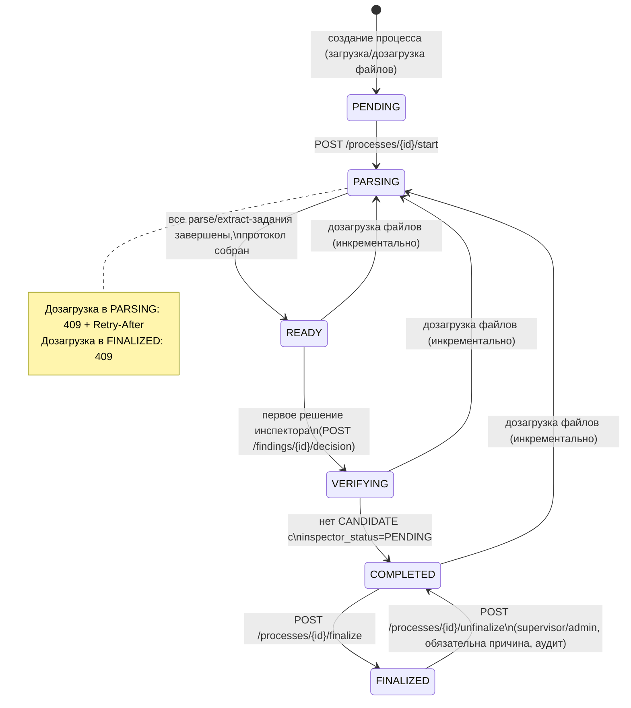
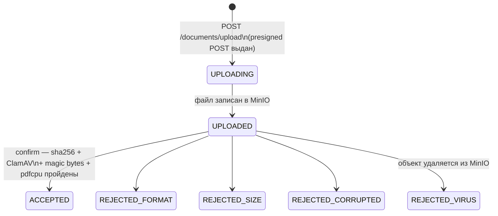
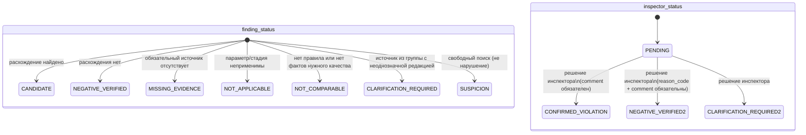
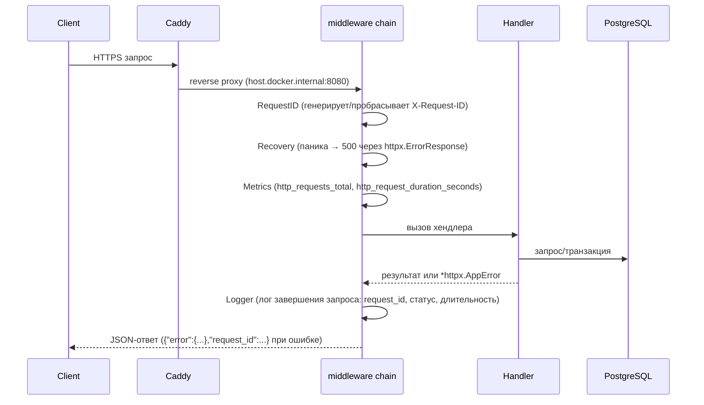
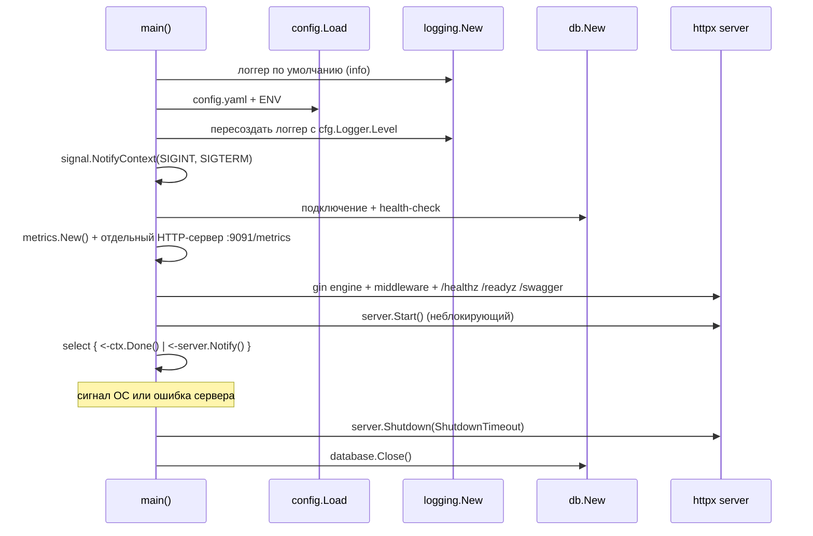

# Жизненные циклы

Архитектура и паттерны — в [architecture.md](architecture.md). Здесь — как во времени живут ключевые
сущности и процессы: от старта сервиса до финализации протокола проверки. Enum-значения — канонические,
строго как в [backend-plan.md §4.1](backend-plan.md#41-enum-значения-строго-как-в-тз) (правило работы №3:
не придумывать новые названия статусов).

## Процесс проверки (`process_status`)

Центральный жизненный цикл домена — один процесс проверки одного объекта.



Правила переходов (backend-plan.md §4.2, обязательны к соблюдению в коде домена `process`, начиная с M2):

- **Дозагрузка файлов** разрешена в `PENDING`, `READY`, `VERIFYING`, `COMPLETED`. В `PARSING` — `409` с
  `Retry-After`. В `FINALIZED` — `409` (после финализации дозагрузка только помечает «есть новые
  документы» и предлагает создать новый процесс, автоматической проверки не запускает).
- **Верификация findings** разрешена в `READY`, `VERIFYING`, `COMPLETED` (до финализации).
- **Финализация** — только если у всех `findings` со статусом `CANDIDATE` `inspector_status != PENDING`
  (допускается перевод в `CLARIFICATION_REQUIRED`). `MISSING_EVIDENCE` выводится отдельным перечнем,
  не блокирует финализацию.
- **`unfinalize`** — только роли `supervisor`/`admin`, обязательное поле `reason`, событие в `audit_log`.
- Финализация публикует `rin.sync.requested` (outbox) и переводит `protocols.sync_status` в `PENDING_SYNC`.

## Файл (`file_check_status`)



Дубликат по `sha256` в рамках процесса не создаёт новую запись — возвращается существующий `file_id`
(backend-plan.md §8.1). `ACCEPTED`-файлы дальше проходят через выбор актуальной редакции
(`selection_status`: `is_current` / `CLARIFICATION_REQUIRED` с причиной, backend-plan.md §8.2) —
это отдельный слой поверх `file_check_status`, не заменяет его.

## Finding

Два независимых поля: `finding_status` (что решил движок проверок) и `inspector_status` (что решил
человек).



Важное правило (`backend/CLAUDE.md` №6): **`CONFIRMED_VIOLATION` может поставить только человек** через
`POST /findings/{id}/decision`. Движок проверок (`engine`) никогда не присваивает этот статус — максимум
`CANDIDATE`. Составной `finding` инспектор может разбить на атомарные (`POST /findings/{id}/split`) —
новые записи ссылаются на исходную через `parent_finding_id`.

Каждое решение атомарно (backend-plan.md §8.8): обновление `finding` + запись `audit_log` + запись
`dataset_items` (черновик GOLD: `CONFIRMED_VIOLATION` → положительный пример, `NEGATIVE_VERIFIED` →
отрицательный; `CLARIFICATION_REQUIRED` в GOLD не попадает) — одна транзакция через `db.WithTx`.

## Инкрементальный пересчёт

При дозагрузке файлов после `READY`/`VERIFYING`/`COMPLETED` пересчитываются только затронутые
`(stage, discipline)` пары, а не весь процесс заново (требование ТЗ: ≤ 1 мин на пересчёт):

- Для `evidence_group` с неизменным `input_hash` (хеш фактов и файлов, входящих в группу) — решение
  инспектора сохраняется как есть.
- Для группы с изменившимся `input_hash` — создаётся новый `finding` с `inspector_status=PENDING`,
  старый архивируется через `superseded_by`. Предыдущая версия протокола не удаляется.

## Событие Kafka: от бизнес-транзакции до DLQ

```mermaid
sequenceDiagram
    participant Domain as Доменный код (api/engine)
    participant PG as PostgreSQL
    participant Relay as cmd/relay
    participant Kafka
    participant Consumer as Consumer (engine/rin-sync/воркер)

    Domain->>PG: BEGIN
    Domain->>PG: бизнес-изменение + INSERT outbox_events (status=pending)
    Domain->>PG: COMMIT
    Note over Domain,PG: WithTx — одна транзакция (architecture.md#unit-of-work)

    loop опрос
        Relay->>PG: SELECT ... FOR UPDATE SKIP LOCKED LIMIT 100
        Relay->>PG: UPDATE status='publishing'
        Relay->>Kafka: publish
        alt delivery report OK
            Relay->>PG: UPDATE status='published'
        else ошибка
            Relay->>PG: UPDATE status='failed', available_at += backoff
        end
    end

    Kafka->>Consumer: poll
    Consumer->>PG: BEGIN
    Consumer->>PG: INSERT consumed_events ON CONFLICT DO NOTHING
    alt уже обработано (0 строк)
        Consumer->>PG: COMMIT
        Consumer->>Kafka: commit offset (no-op бизнес-логики)
    else новое событие
        Consumer->>PG: бизнес-логика + INSERT outbox_events (если нужно)
        Consumer->>PG: COMMIT
        Consumer->>Kafka: commit offset
    end

    Note over Consumer,Kafka: после 3 неудачных попыток с backoff —\npublish в &lt;topic&gt;.dlq, offset коммитится
```

Полное описание топиков и конверта события — [architecture.md#событийная-архитектура](architecture.md#событийная-архитектура).

## HTTP-запрос



Реализация порядка middleware — `cmd/api/main.go`: `RequestID → Recovery → Logger → Metrics`.

## Жизненный цикл сервиса (`cmd/api`)



Тот же принцип применяется (и будет применяться при реализации M1+) к `cmd/relay`/`cmd/engine`:
на сигнал завершения — `consumer.Close()` и `producer.Flush()` перед выходом процесса, чтобы не терять
недокоммиченные офсеты и недоставленные сообщения.
